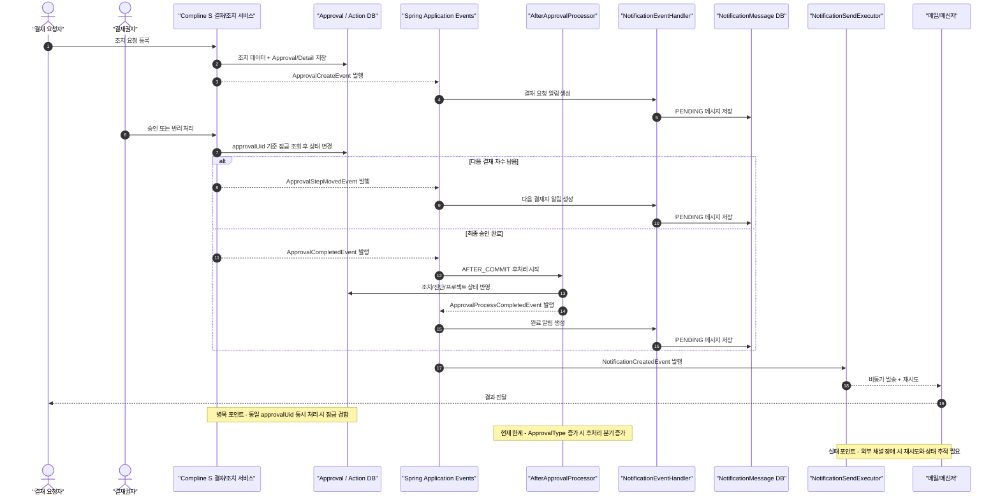

# F5 Kafka 사전 과제 제출

## 제출자

- 이름: 황은경
- 깃허브 계정: yhr05008@naver.com

## 선택한 비즈니스 흐름

### 핵심 시나리오

- 보안 진단 결과에 대한 조치 요청이 등록되면 시스템이 결재 문서를 생성하고, 결재권자가 승인 또는 반려를 처리한 뒤, 최종 승인 시 실제 조치 상태를 반영하고 요청자와 관련자에게 알림을 발송하는 흐름을 선택했다.

### 이 흐름을 선택한 이유

- 조치 데이터 저장, 결재 생성, 승인 상태 변경, 승인 완료 후처리, 외부 알림 발송이 한 요청 안에 연결되어 있어 단순 CRUD보다 복잡하다.
- 같은 결재 문서를 여러 사용자가 동시에 처리할 수 있어 동시성 제어와 상태 정합성이 중요하다.
- 승인 자체는 강한 정합성이 필요하지만, 알림과 후속 처리는 비동기로 분리할 여지가 있어 EDA/Kafka 적용 여부를 판단하기 좋은 사례다.
- 현재 저장소도 이 흐름을 실제로 반영하고 있다. `ApprovalSubmitService`, `ApprovalProcessor`, `AfterApprovalProcessor`, `NotificationDomainEventBridge`, `NotificationListener`가 각각 생성, 승인, 후처리, 알림 연결을 담당한다.

## 과제 1-1. 현재 구조 도식화

### 전체 흐름도

현재 구조를 보면 이 시스템은 완전한 동기 CRUD만 사용하는 것은 아니다. Kafka는 없지만, Spring `ApplicationEventPublisher`와 `@TransactionalEventListener`를 이용해 같은 애플리케이션 내부에서 이벤트 기반 후처리를 이미 일부 적용하고 있다.

### 등장하는 사용자/시스템/외부 연동

- 사용자: 결재 요청자, 결재권자
- 내부 시스템: Compline S 결재 제출/처리 서비스, Approval / Action DB, Spring application event 레이어, 결재 완료 후처리 모듈, 알림 메시지 저장 및 발송 모듈
- 외부 연동: 메일 서버, 메신저 채널

### 요청과 데이터 흐름

1. 결재 요청자가 조치 상태 변경을 요청한다.
2. `ApprovalSubmitService`가 결재선을 조회하고 `ApprovalWriter`를 통해 `Approval`, `ApprovalDetail` 데이터를 저장한다.
3. 결재 생성 직후 `ApprovalCreateEvent`가 발행되고, 알림 모듈이 결재 요청 메시지를 `NotificationMessage` 테이블에 `PENDING` 상태로 저장한다.
4. 결재권자가 승인 또는 반려를 처리하면 `ApprovalProcessor`가 같은 결재 문서를 잠금 조회한 뒤 상태를 변경한다.
5. 아직 최종 결재가 아니면 `ApprovalStepMovedEvent`가 발행되고, 다음 결재자에게 전달할 알림 메시지가 저장된다.
6. 최종 결재가 완료되면 `ApprovalCompletedEvent`가 발행되고, `AfterApprovalProcessor`가 별도 트랜잭션에서 실제 조치 상태나 프로젝트 상태를 반영한다.
7. 후처리가 끝나면 `ApprovalProcessCompletedEvent`가 발행되고, 요청자와 관련자에게 보낼 완료 알림 메시지가 저장된다.
8. `NotificationListener`가 `NotificationCreatedEvent`를 받은 뒤 `NotificationSendExecutor`를 통해 외부 메일/메신저 발송을 비동기로 수행한다.

### 병목 또는 장애 포인트

- 결재 승인/반려 구간은 같은 문서를 동시에 처리할 수 있어 잠금 경합이 발생할 수 있다. 이 구간은 병목이 될 수 있지만 정합성을 위해 쉽게 제거할 수 없는 병목이다.
- 최종 결재는 완료되었는데 `AfterApprovalProcessor`에서 실제 조치 상태 반영이 실패하면, 승인 상태와 업무 상태가 일시적으로 어긋날 수 있다.
- 외부 메일/메신저 발송은 네트워크 상태와 외부 시스템 가용성에 의존하므로 실패 가능성이 높다. 따라서 메시지 상태 저장, 재시도, 장애 감지가 필요하다.

### 현재 구조의 한계

- 결재 완료 후처리가 `ApprovalType` 분기 중심으로 커지고 있어 결재 종류가 늘수록 서비스 복잡도가 증가한다.
- 현재 이벤트는 같은 애플리케이션 내부 이벤트이기 때문에, 다른 서비스가 독립적으로 구독하거나 재처리하기에는 한계가 있다.
- 알림 메시지는 저장 후 비동기 발송으로 분리되어 있지만, 운영자는 어느 단계에서 실패했는지 계속 추적해야 한다.

## 과제 1-2. EDA/Kafka 적용 검토

### 적용 여부

- EDA는 이미 부분 적용되어 있다. 다만 Kafka는 지금 당장 전면 도입하기보다, 최종 승인 이후 후처리와 알림 구간에 한해 제한적으로 검토하는 것이 맞다고 판단했다.

### 판단 근거

- 결재 승인/반려 구간은 사용자 응답과 정합성이 직접 연결되어 있어 동기 트랜잭션이 더 현실적이다.
- 현재 저장소는 이미 Spring application event를 사용해 생성, 상태 이동, 완료 후처리, 알림 발송을 느슨하게 분리하고 있다. 즉 “문제 자체가 EDA가 없는 것”은 아니다.
- Kafka가 진짜 이점을 주는 시점은 여러 서비스가 같은 결재 이벤트를 각자 소비해야 하거나, 알림/감사로그/통계/외부 연동을 독립적으로 확장해야 할 때다.
- 반대로 지금 바로 Kafka를 붙이면 브로커 운영, 이벤트 스키마 버전 관리, 재처리 정책, outbox 설계 같은 운영 비용이 먼저 늘어난다.

### 이벤트로 분리할 수 있는 흐름

- 결재 생성 이후 결재 요청 알림 발송
- 결재 단계 이동 이후 다음 결재자 알림 발송
- 최종 승인 이후 실제 조치 상태 반영
- 후처리 완료 이후 완료 알림, 감사 로그, 통계 적재

### 이벤트 정의

- `ApprovalCreateEvent`: `approvalUid`, `approvalType`, `requestUserId`, `currentStep`, `recipientUserIds`, `requestedAt`
- `ApprovalStepMovedEvent`: `approvalUid`, `approvalType`, `fromStep`, `toStep`, `nextApproverIds`, `changedAt`
- `ApprovalCompletedEvent`: `approvalUid`, `approvalType`, `finalStatus`, `detailIds`, `approvedAt`
- `ApprovalProcessCompletedEvent`: `approvalUid`, `approvalType`, `affectedResourceIds`, `processResult`, `completedAt`
- `NotificationCreatedEvent`: `messageId`, `channelType`, `recipient`, `templateType`, `dedupKey`

### Producer

- 결재 생성 모듈: `ApprovalSubmitService`
- 결재 승인/반려 모듈: `ApprovalCommandService`, `ApprovalProcessor`
- 승인 완료 후처리 모듈: `AfterApprovalProcessor`
- 실제 Kafka 발행은 서비스 코드가 직접 수행하기보다 outbox relay가 대신 수행하는 방식이 안전하다.

### Consumer

- 승인 완료 후 실제 업무 상태를 반영하는 후처리 서비스
- 메일/메신저 채널 발송 서비스
- 향후 분리 가능성이 있는 감사 로그, 통계, 운영 모니터링 서비스

### 동기 호출보다 낫거나, 낫지 않다고 판단한 이유

- 결재 승인/반려 자체는 동기 호출이 더 낫다. 사용자는 즉시 승인 성공/실패를 알아야 하고, 같은 `approvalUid`에 대한 상태 경쟁을 하나의 트랜잭션 안에서 끝내는 편이 단순하다.
- 반면 최종 승인 이후 알림, 감사, 통계, 외부 연동은 Kafka가 더 잘 맞는다. 한 소비자가 실패해도 결재 완료 자체를 막지 않아도 되고, 나중에 소비자를 추가해도 결재 서비스 코드를 크게 바꾸지 않아도 된다.
- 즉 이 흐름에서는 “핵심 상태 변경은 동기”, “후속 확장 작업은 이벤트”가 더 적절하다. Kafka가 맞는 구간이 있고, 오히려 맞지 않는 구간도 분명하다.

### 운영 시 주의할 점

- 멱등성: 같은 이벤트가 중복 전달될 수 있으므로 `approvalUid + eventType + step` 또는 `messageId` 기준으로 중복 처리 방지가 필요하다.
- 순서 보장: 같은 결재 문서 이벤트는 같은 파티션 키(`approvalUid`)로 보내야 생성, 단계 이동, 완료 순서를 최대한 유지할 수 있다.
- 재처리: 소비자 실패 시 DLQ와 수동 재처리 기준이 필요하며, 재실행해도 업무 상태가 깨지지 않아야 한다.
- 장애 복구: DB 커밋과 Kafka 발행 사이의 이중 쓰기 문제를 막기 위해 outbox pattern이나 재동기화 배치가 필요하다.

## 과제 2. Event Driven Architecture 핵심 개념 정리

### Event Driven Architecture란 무엇인가?

- Event Driven Architecture는 어떤 상태 변화가 발생했을 때 그 사실을 이벤트로 표현하고, 다른 컴포넌트가 그 이벤트를 받아 후속 동작을 수행하는 구조다.
- 이 과제의 흐름에 붙여서 말하면, “결재가 생성되었다”, “결재 단계가 이동했다”, “결재가 최종 승인되었다” 같은 사실을 이벤트로 만들고, 알림이나 후처리 모듈이 그 사실에 반응하는 방식이다.
- 현재 저장소는 Kafka는 없지만 Spring application event를 이용해 이미 이 구조를 내부적으로 일부 사용하고 있다.

### 어떤 상황에서 특히 유리한가?

- 하나의 요청 뒤에 여러 후속 작업이 따라오는 경우
- 사용자가 모든 후속 작업이 끝날 때까지 기다릴 필요가 없는 경우
- 나중에 알림, 통계, 감사, 외부 연동 같은 소비자를 추가할 가능성이 큰 경우
- 후속 처리의 처리량과 장애 특성을 핵심 트랜잭션과 분리하고 싶은 경우

### 대표적인 단점이나 운영 비용은 무엇인가?

- 요청 하나의 전체 흐름을 추적하기가 동기 호출보다 어렵다.
- 최종 일관성 모델을 받아들여야 하므로 “승인은 끝났지만 후처리는 아직” 같은 상태가 생길 수 있다.
- 중복 이벤트, 순서 문제, 재처리 전략, DLQ 운영을 설계해야 한다.
- Kafka까지 도입하면 브로커 운영, 모니터링, 스키마 버전 관리, 장애 복구 절차가 추가된다.

### Kafka는 EDA 안에서 어떤 역할을 하는가?

- Kafka는 EDA 자체가 아니라, 이벤트를 안전하게 저장하고 전달하는 broker 역할을 한다.
- Producer가 만든 이벤트를 durable log에 저장하고, Consumer가 각자 속도로 읽고 재처리할 수 있게 해준다.
- 즉 EDA가 “구조적 개념”이라면 Kafka는 그 구조를 구현할 때 사용할 수 있는 “인프라 컴포넌트”에 가깝다.

### 내가 고른 비즈니스 흐름에서는 Kafka가 왜 필요하거나, 왜 아직 필요하지 않은가?

- 이 흐름에서 Kafka가 가장 잘 맞는 지점은 결재 완료 이후의 후처리와 알림이다. 이 부분은 이미 현재 구조에서도 이벤트와 비동기 처리로 분리되어 있다.
- 하지만 지금 저장소 기준으로는 여전히 하나의 애플리케이션 안에서 처리되는 비중이 크고, 핵심 문제도 이벤트 전송량보다 결재 정합성과 후처리 실패 관리에 가깝다.
- 그래서 지금 당장은 Kafka를 넣는 것보다 현재의 내부 이벤트 구조를 더 명확하게 운영하는 편이 현실적이다.
- 다만 앞으로 알림 서비스, 감사 로그, 통계 적재, 외부 시스템 연동이 별도 서비스로 분리되거나 소비자가 계속 늘어난다면, 그때는 현재의 Spring 내부 이벤트를 Kafka 외부 이벤트로 확장하는 방향이 자연스럽다.

## 참고 자료

- `src/main/java/wicon/project/a/management/console/advancement/approval/service/ApprovalSubmitService.java`
- `src/main/java/wicon/project/a/management/console/advancement/approval/domain/service/ApprovalProcessor.java`
- `src/main/java/wicon/project/a/management/console/advancement/approval/domain/service/AfterApprovalProcessor.java`
- `src/main/java/wicon/project/a/management/console/advancement/approval/event/listener/ApprovalEventListener.java`
- `src/main/java/wicon/project/a/management/console/advancement/notification/event/listener/NotificationDomainEventBridge.java`
- `src/main/java/wicon/project/a/management/console/advancement/notification/event/listener/NotificationListener.java`
- `src/main/java/wicon/project/a/management/console/advancement/notification/service/NotificationSendExecutor.java`
