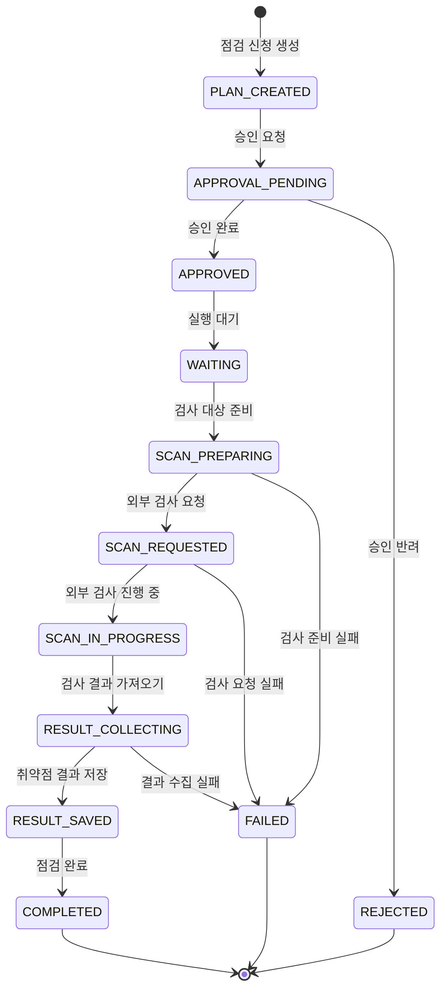
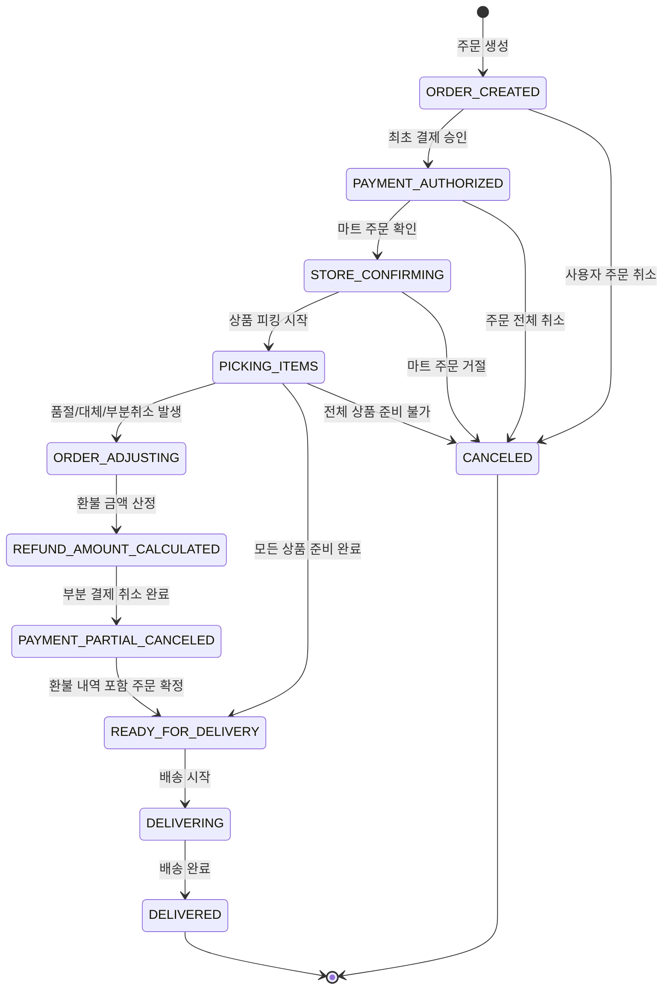

# 이벤트 드리븐 아키텍처 상태 머신 사례

이 문서는 이벤트 드리븐 아키텍처에서 상태 머신을 어떻게 바라볼 수 있는지 두 가지 사례로 정리한 것이다. 여기서 상태 머신은 하나의 업무 대상이 현재 어떤 상태에 있고, 어떤 이벤트가 발생했을 때 다음 상태로 이동하는지를 표현한 것이다.

첫 번째는 현업에서 직접 구현한 외부 취약점 검사 도구 연동 사례이고, 두 번째는 일상생활에서 관찰한 B마트 주문 부분 환불 사례이다.

## 사례 1. 외부 취약점 검사 연동

현업에서 직접 구현한 외부 취약점 검사 도구 연동을 이벤트 드리븐 아키텍처 관점에서 정리했다. 이 사례에서는 사용자가 서버 취약점 점검을 신청하면 승인, 외부 검사 도구 실행, 결과 가져오기, 결과 저장까지 이어지며 하나의 보안 점검 업무가 완성된다.

### 상태 머신의 주어

이 상태 머신의 주어는 시스템 전체가 아니라 **점검 실행 건**이다. 즉, 사용자가 신청한 취약점 점검 하나가 지금 어떤 단계에 있는지를 표현한다.

### 점검 실행 상태 다이어그램

### 주요 상태 의미

| 상태 | 쉬운 의미 |
| --- | --- |
| `PLAN_CREATED` | 사용자가 취약점 점검을 신청한 상태 |
| `APPROVAL_PENDING` | 관리자의 승인을 기다리는 상태 |
| `APPROVED` | 점검 신청이 승인된 상태 |
| `WAITING` | 예약 시간 또는 실행 순서를 기다리는 상태 |
| `SCAN_PREPARING` | 외부 검사 도구에서 검사할 서버나 IP를 준비하는 상태 |
| `SCAN_REQUESTED` | 외부 검사 도구에 검사를 요청한 상태 |
| `SCAN_IN_PROGRESS` | 외부 검사 도구가 취약점 검사를 수행 중인 상태 |
| `RESULT_COLLECTING` | 외부 검사 도구에서 검사 결과를 가져오는 상태 |
| `RESULT_SAVED` | 가져온 취약점 결과를 시스템에 저장한 상태 |
| `COMPLETED` | 점검이 정상적으로 끝난 상태 |
| `FAILED` | 준비, 요청, 결과 수집 중 문제가 생겨 실패한 상태 |
| `REJECTED` | 승인 단계에서 반려된 상태 |

### 사용자 관점

사용자는 처음에 점검 신청서를 작성하고 승인 요청을 보낸다. 승인 전에는 "승인 대기" 상태를 보고, 승인 후에는 "실행 대기" 또는 "검사 진행 중" 상태를 확인한다. 검사가 끝나면 취약점 목록, 위험도, 조치 가이드 같은 결과를 화면에서 확인한다.

### 이벤트 드리븐 관점

이 흐름은 각 단계가 끝날 때 다음 단계로 이어지는 이벤트를 발생시키는 구조로 볼 수 있다. 예를 들어 승인이 완료되면 점검 실행 대기 상태로 넘어가고, 외부 검사 요청이 성공하면 검사 진행 상태가 된다. 이후 검사 완료 신호를 기준으로 결과 수집이 시작되고, 결과 저장이 끝나면 점검 완료 상태가 된다.

중요한 점은 외부 도구와 연동되는 구간에서는 실패나 지연이 발생할 수 있다는 것이다. 따라서 검사 요청 실패, 결과 수집 실패, 외부 검사 진행 지연 같은 상태를 별도로 고려해야 한다.

## 사례 2. B마트 주문 부분 환불

일상생활에서 B마트 배달을 이용하다가 일부 상품이 품절되어 대체 상품을 받았고, 일부 금액은 부분 결제 취소된 경험을 바탕으로 주문, 환불 금액 산정, 부분 환불 흐름을 상태 머신으로 표현해보았다.

### 상태 머신의 주어

이 다이어그램의 주어는 B마트 시스템 전체가 아니라, 사용자가 생성한 주문 한 건이다. 즉 각 상태는 특정 주문이 현재 어떤 단계에 있는지를 나타낸다.

이 사례의 핵심은 주문 전체가 실패한 것이 아니라, 주문은 계속 진행되는 동안 일부 상품 상태가 변경되고 그 결과 환불 금액이 별도 항목으로 붙는다는 점이다. 원 주문 및 최초 결제 내역은 유지되고, 취소된 상품 금액만큼 환불 또는 부분 결제 취소 내역이 추가로 기록되는 흐름으로 볼 수 있다.

### 주문 상태 다이어그램

### 주요 상태 의미

| 상태 | 의미 |
| --- | --- |
| `ORDER_CREATED` | 사용자가 B마트 주문을 생성한 상태 |
| `PAYMENT_AUTHORIZED` | 최초 주문 금액으로 결제가 승인된 상태 |
| `STORE_CONFIRMING` | 마트가 주문을 확인하는 상태 |
| `PICKING_ITEMS` | 마트에서 실제 상품을 담는 상태 |
| `ORDER_ADJUSTING` | 품절, 대체 상품, 부분 취소 등으로 주문 구성이 변경되는 상태 |
| `REFUND_AMOUNT_CALCULATED` | 취소된 상품 또는 가격 차이에 따라 환불 금액이 산정된 상태 |
| `PAYMENT_PARTIAL_CANCELED` | 산정된 환불 금액만큼 부분 결제 취소가 완료된 상태 |
| `READY_FOR_DELIVERY` | 최종 주문 구성이 확정되어 배송 준비가 된 상태 |
| `DELIVERING` | 배송 중인 상태 |
| `DELIVERED` | 배송이 완료된 상태 |
| `CANCELED` | 사용자 취소, 마트 거절, 전체 상품 준비 불가 등으로 주문이 취소된 상태 |

### 사용자 관점

사용자는 주문 직후에는 결제 완료 상태를 보고, 마트 피킹 중에는 상품 준비 중 상태를 본다. 일부 상품이 품절되면 대체 상품 적용 또는 부분 취소 안내를 받고, 부분 결제 취소가 완료되면 원 결제 내역 아래에 환불 금액이 별도 항목으로 붙은 것을 확인한다. 배송 완료 후에는 최종 영수증과 현금영수증 발행 내역을 확인할 수 있다.

## 정리

상태 머신을 설계할 때는 먼저 상태의 주어를 정해야 한다. 외부 취약점 검사 연동에서는 점검 실행 건이 상태를 가지고, B마트 주문 환불 사례에서는 주문 한 건이 상태를 가진다.

또한 핵심 상태와 후속 이벤트를 구분하고, 실패나 부분 처리도 함께 표현해야 한다. 외부 검사 요청 실패, 결과 수집 실패, 상품 품절, 부분 환불 같은 흐름을 포함해야 실제 비즈니스에 가까운 상태 머신이 된다.
